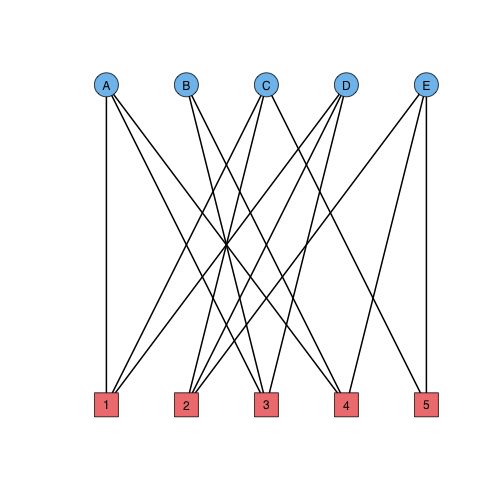
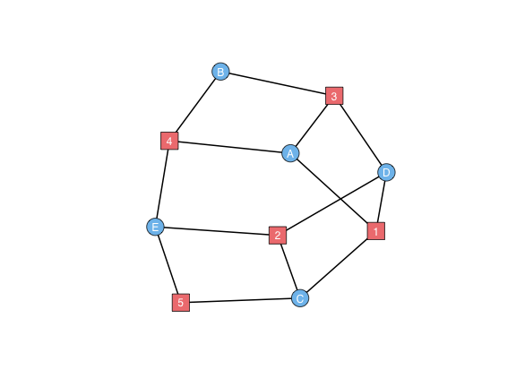
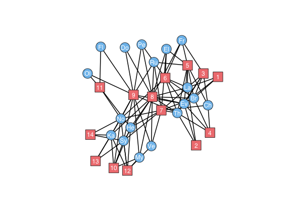
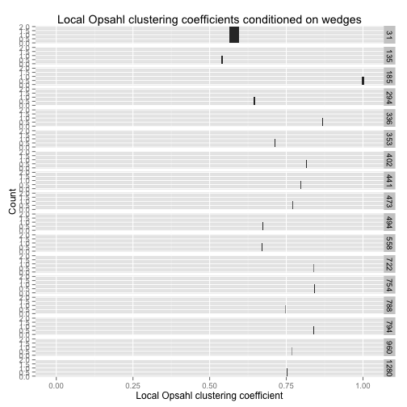
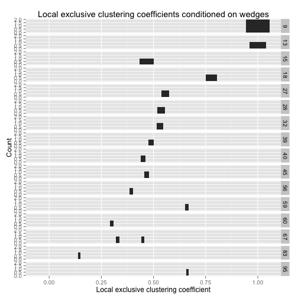

Triadic analyses of two-mode networks
=====================================

The paper "Triadic analysis for two-mode networks" will make a case for adopting a coherent batch of triad-centric tools for the study of two-mode, usually affiliation, networks. This R Markdown file will apply these tools to the study of several manageably-sized real-world affiliation networks, in hopes of giving the reader a feel for what they mean, how they can be used, and what can be learned from them.

We use the "igraph" package, which provides the class of graphs and the basic suite of tools we build upon. We'll also read data and functions from the github account corybrunson; the custom functions below make use of the function 'source_https' is taken from [tonybreyal](http://tonybreyal.wordpress.com/2011/11/24/source_https-sourcing-an-r-script-from-github/ "tonybreyal").


The author is neither a programmer nor a computer scientist by training; any suggestions on how to make this document or the suite of functions it overviews would be most welcome.

## Network 1: Southern women

In their book [*Deep South*](http://books.google.com/books?id=Q3b9QTOgLFcC), two couples of social anthropologists presented a comprehensive case study of the American caste system as it operated in a rural southern town. Among their records were several tables of coattendance at distinct events by groups of acquainted women. One of these, labeled Clique A (p. 209, Fig. 11) consists of five women, designated "Miss A" through "Miss E", and five events, which we refer to as bridge, dinner, movies, dance, and visiting, each of which was attended by a subset of the women. The attendance table is reproduced in the file "DGG\_Clique\_A.csv", which we load into R directly as a graph:


```r
ddgg <- graph.incidence(as.matrix(mycsv('DGG_Clique_A.csv', row.names = 1)))
```

Since the graph is bipartite, we can get all the incidence information we need from one corner of the full adjacency matrix. Due to the structure of the file and the import method, the actor nodes are listed first and the event nodes second:


```r
get.incidence(ddgg)
```

```
##        Bridge Dinner Movies Dance Visiting
## Miss A      1      0      1     1        0
## Miss B      0      0      1     1        0
## Miss C      1      1      0     0        1
## Miss D      1      1      1     0        0
## Miss E      0      1      0     1        1
```

### Visualization

First let's visualize the network, using the visual scheme from [Opsahl's paper](http://toreopsahl.com/2011/12/21/article-triadic-closure-in-two-mode-networks-redefining-the-global-and-local-clustering-coefficients/ "Opsahl"):


```r
plot(ddgg, layout = matrix(c(rep(seq(-1, 1, length.out = 5), times = 2),
                              rep(c(1, -1), each = 5)), nc = 2),
     vertex.color = ifelse(V(ddgg)$type == 0, 'SkyBlue2', 'lightcoral'),
     vertex.shape = ifelse(V(ddgg)$type == 0, 'circle', 'square'),
     edge.width = 2, edge.color = 'black',
     vertex.label = c(LETTERS[1:5], 1:5),
     vertex.label.family = 'sans', vertex.label.color = 'black')
```

 

The individuals and events are pretty evenly connected --- three ties each, except for one individal (Miss B) and one event (visiting) having two ties each. The layout clearly distinguishes the nodes but offers only indirect insight into the relative rates of attendance of the individuals or events. Alternatively, we can visualize the nodes using the Fruchterman-Reingold algorithm:


```r
set.seed(10)
plot(ddgg, layout = layout.fruchterman.reingold(ddgg, niter = 100),
     vertex.color = ifelse(V(ddgg)$type == 0, 'SkyBlue2', 'lightcoral'),
     vertex.shape = ifelse(V(ddgg)$type == 0, 'circle', 'square'),
     edge.width = 2, edge.color = 'black',
     vertex.label = c(LETTERS[1:5], 1:5),
     vertex.label.family = 'sans', vertex.label.color = 'black')
```

 

This layout reveals a symmetry of the network between its actor and event nodes: Exchanging Miss A and Event 2, Miss B and Event 5, and so on yields a graph isomorphism. Thus any structural information we learn about the actors in this network can be flipped into equivalent information about the events.

### Triad census

This social network is just large enough exhibit a diversity of triads and just small enough to allow us to examine them in detail. (Future networks will only be examined cursorily or through statistics.) We can view the (undirected) triad census of the one-mode projection, taking the actor-based one-mode projection:


```r
ddgg.proj <- onemode.projection(ddgg)
stc <- simple.triad.census(ddgg.proj, rcnames = TRUE)
stc
```

```
## 0 1 2 3 
## 0 0 3 7
```

We have no disconnected triples at all; only three 'wedges' or 'vees' and seven 'triangles'. But these probably exhibit some diversity of their own that is lost in the projection. We can take a look at the two-mode triad census using the function 'twomode.triad.census':


```r
tmtc <- twomode.triad.census(ddgg, rcnames = TRUE)
tmtc
```

```
##         0 1
## (0,0,0) 0 0
## (1,0,0) 0 1
## (1,1,0) 0 3
## (1,1,1) 1 0
## (2,0,0) 0 0
## (2,1,0) 3 0
## (2,1,1) 2 0
## (2,2,0) 0 0
## (2,2,1) 0 0
## (2,2,2) 0 0
```

The arrangement is far less intuitive than that of the simple census. The rows are labeled according to the partition ( x ≥ y ≥ z ) formed from the number of events coattended by each pair of women in a triad but not the other; for instance, Miss A and Miss B attended two events (movies and dance) without Miss C, and Miss A and Miss C attended one event (bridge) without Miss B, while Miss B and Miss C attended no events together. Thus the triad (A, B, C) is tallied in the sixth row of the census, labeled by the partition (2 ≥ 1 ≥ 0). We already observed that Miss B and Miss C attended no events together at all --- even without Miss A. Therefore not only is the third part of the partition zero, but so is the value of w, the "triad weight" that indexes the columns of the census. The triad is identified by this pair of objects (pairwise partition and triad weight): ( ( 2 ≥ 1 ≥ 0 ), 0 ).

### Global clustering coefficients

The classical (global) clustering coefficient for a one-mode network may be defined either as the proportion of "wedges" that are "closed" or as the ratio of (three times) the number of "triangles" to the number of "wedges". Here wedges are 2-paths, distinguished by the relative positions of the nodes but not by their progression, and a wedge is considered closed if its end nodes are tied. (To avoid confusion i won't get into the other definition.) Since every triad of three edges counts thrice as a closed wedge, we can compute the clustering coefficient of the one-mode projection directly from the simple census:


```r
C <- 3 * stc[4] / (stc[3] + 3 * stc[4])
C
```

```
##     3 
## 0.875
```

The value tells us what proportion of the time each pair of three women have co-attended at least one event, given that two pairs have. (Note that this is a different value from the proportion of the time that two women have co-attended an event, given that they have at least one common co-attendee between them.) The clustering coefficient has proven a valuable, though heavily biased, single-value indicator of transitivity --- the tendency for near-connections to indicate direct connections, or for "friends of friends" to in fact be "friends".

Naturally, this diagnostic can also be recovered from the two-mode census; for this and other recoveries we call a suite of functions written for the purpose:


```r
tc2C(tmtc)
```

```
## [1] 0.875
```

In the paper "Triadic analysis for two-mode networks", i discuss in detail three alternative clustering coefficients specifically designed for two-mode networks. The first of these is [Opsahl's]((http://toreopsahl.com/2011/12/21/article-triadic-closure-in-two-mode-networks-redefining-the-global-and-local-clustering-coefficients/):


```r
tc2CO(tmtc)
```

```
## [1] 0.6111
```


```r
global.c1 <- c(C = tc2C(tmtc), C.O = tc2CO(tmtc), C.N = tc2Cin(tmtc), C.X = tc2Cex(tmtc))
global.c1
```

```
##      C    C.O    C.N    C.X 
## 0.8750 0.6111 0.7826 0.6000
```

### Local clustering coefficients

So far we have only tried to gauge transitivity tendencies in the network as a whole; that is, we have been looking at global network properties. But triadic analysis has always taken place at two levels --- the micro and the macro. For example, the Davis/Holland/Leinhardt studies tested macro network properties through their micro predictions, Faust used the triad census to situate multitudes of networks in a common low-dimensional parameter space, and the global clustering coefficient of Barrat and Weigt was developed as a macro counterpart to the micro (local) clustering coefficient of Watts and Strogatz. Having viewed the southern women through this global lens, we now turn to the local.

The classical local clustering coeffiicent at a node Q is the proportion of pairs of neighbors of Q who are themselves neighobrs. From the images above we can see that the only pair of women not linked through at least one event are Miss B and Miss C. This means that the only local clustering coefficients we'll observe are 5/6 (for women who count Miss B and Miss C among their neighobrs) and 1 (for Miss B and Miss C). To verify, we specify the type to 'local' in the base igraph function:


```r
local.c <- transitivity(ddgg.proj, type = 'local')
local.c
```

```
## [1] 0.8333 1.0000 1.0000 0.8333 0.8333
```

Our two-mode-sensitive candidates, as implemented independently (rather than through the two-mode triad census) are specialized with a similar local option for type:


```r
local.c.df <- cbind(c = local.c,
                    c.O = opsahl.transitivity(ddgg, type = 'local'),
                    c.N = incl.transitivity(ddgg, type = 'local'),
                    c.X = excl.transitivity(ddgg, type = 'local'))
rownames(local.c.df) <- V(ddgg.proj)$name
local.c.df
```

```
##             c    c.O    c.N  c.X
## Miss A 0.8333 0.5000 0.6667 0.50
## Miss B 1.0000 0.6667 0.6667 1.00
## Miss C 1.0000 0.6667 1.0000 0.50
## Miss D 0.8333 0.6000 0.8333 0.50
## Miss E 0.8333 0.7143 0.8000 0.75
```

As a reality check, we can test the 'global' option for type of these implementations against the global values produced from the two-mode triad census.


```r
global.c2 <- c(transitivity(ddgg.proj),
               opsahl.transitivity(ddgg),
               incl.transitivity(ddgg),
               excl.transitivity(ddgg))
data.frame(Census = global.c1, Separate = global.c2)
```

```
##     Census Separate
## C   0.8750   0.8750
## C.O 0.6111   0.6111
## C.N 0.7826   0.7826
## C.X 0.6000   0.6000
```

### Wedge-dependent local clustering

One of the most [thoroughly documented](http://arxiv.org/abs/cond-mat/0211528) properties of social networks is the inverse relationship, taken across nodes, between the degree and the (classical) local clustering coefficient. This relationship can be repackaged as one between the *potential* for clustering at a node Q, given by the number of 2-paths through Q (this number is k(k - 1)/2, or "k choose 2", when Q has degree k), and the *actual* clustering at Q, given either as the number of these 2-paths that are closed or as the local clustering coefficient (which is this number divided by the number of 2-paths).

The typical analysis plots the mean "degree-dependent" local clustering coefficient, taken over all nodes of a fixed degree, against the degree. The framework also prompts a question i have not yet found answered in the literature: For a fixed degree k, what does the distribution of local clustering coefficients at nodes of degree k look like? The assumption underlying the typical analysis is that the mean of this distribution is a reasonable one-variable summary of it, but the possibility exists that these distributions are skewed, bimodal, or otherwise nonnormal.

While Clique A is too small to draw general inferences from, it can at least provide a case study and a demonstration of these diagnostics. Since the "degree" and "transitivity" functions (the latter using the 'local' value of type) are evaluated at the nodes in order of their IDs, we can match them up in a simple data frame:


```r
ddc <- data.frame(k = degree(ddgg.proj),
                  c = transitivity(ddgg.proj, type = 'local'))
print(ddc)
```

```
##        k      c
## Miss A 4 0.8333
## Miss B 3 1.0000
## Miss C 3 1.0000
## Miss D 4 0.8333
## Miss E 4 0.8333
```

As we observed above, there is zero variability among nodes of common degree, though we can still plot the relationship between the (trivial) degree-dependent mean local clustering coefficients and the degrees:


```r
plot(aggregate(ddc$c, by = list(ddc$k), FUN = mean), pch = 19, type = 'b',
     main = 'Degree-dependent local clustering',
     xlab = 'Degree', ylab = 'Mean conditional local clustering coefficient')
```

 

Though the curve at least proceeds in the expected direction, there is little insight to be gleaned here. A more heterogeneous network is required. Fortunately for us, another, somewhat larger (but still manageable) table of women and events is available to us, labeled Group I (p. ???, Fig. ?). The data are available [here](), in a different format from the previous data (hence the different procedure to read it):


```r
data <- mytable('Davis_southern_club_women-two_mode.txt', colClasses = 'numeric')
names <- mytable('Davis_southern_club_women-name.txt', colClasses = 'character')
ddgg2 <- graph.data.frame(data.frame(woman = names[data[, 1], 1],
                                      event = data[, 2]), directed = FALSE)
V(ddgg2)$type <- !(substr(V(ddgg2)$name, 1, 1) %in% LETTERS)
```

Again let's begin with a plot:


```r
set.seed(1)
plot(ddgg2, layout = layout.fruchterman.reingold(ddgg2, niter = 100),
     vertex.color = ifelse(V(ddgg2)$type == 0, 'SkyBlue2', 'lightcoral'),
     vertex.shape = ifelse(V(ddgg2)$type == 0, 'circle', 'square'),
     edge.width = 2, edge.color = 'black',
     vertex.label = substr(V(ddgg2)$name, 1, 2),
     vertex.label.family = 'sans', vertex.label.color = 'black')
```

 

The visualization is quite a bit messier, but it looks like we have at least some range of degrees this time:


```r
ddgg2.proj <- onemode.projection(ddgg2)
ddc2 <- data.frame(k = degree(ddgg2.proj),
                   c = transitivity(ddgg2.proj, type = 'local'))
print(ddc2)
```

```
##            k      c
## EVELYN    17 0.8971
## LAURA     15 0.9619
## THERESA   17 0.8971
## BRENDA    15 0.9619
## CHARLOTTE 11 1.0000
## FRANCES   15 0.9619
## ELEANOR   15 0.9619
## PEARL     16 0.9333
## RUTH      17 0.8971
## VERNE     17 0.8971
## MYRNA     16 0.9333
## KATHERINE 16 0.9333
## SYLVIA    17 0.8971
## NORA      17 0.8971
## HELEN     17 0.8971
## DOROTHY   16 0.9333
## OLIVIA    12 1.0000
## FLORA     12 1.0000
```

```r
plot(aggregate(ddc2$c, by = list(k = ddc2$k), FUN = mean), pch = 19, type = 'b',
     main = 'Degree-dependent local clustering',
     xlab = 'Degree', ylab = 'Mean conditional local clustering coefficient')
```

 

There is clearly a trade-off between the number of a woman's acquaintances (through events) and the proportion of those acquaintances that are also acquainted; perhaps one's capacity for acquaintanceship outpaces one's ability to make introductions and forge new acquaintanceships. But how variable is this "forging" process among individuals with the same number of acquaintances? The bars of the local clustering coefficient histograms below are centered at the k(k-1)/2+1 possible values of each local clustering coefficient. (The code is adapted from [this helpful exchange](http://stackoverflow.com/questions/17271968/different-breaks-per-facet-in-ggplot2-histogram).)


```r
library(ggplot2)
library(plyr)
ddc2.breaks <- lapply(sort(unique(ddc2$k)), function(k) {
    wid = 1 / choose(k, 2)
    seq(0 - wid / 2, 1 + wid / 2, wid)
})
hls <- mapply(function(x, b) geom_histogram(data = x, breaks = b),
              dlply(ddc2, .(k)), ddc2.breaks)
ggplot(ddc2, aes(x = c)) +
    hls +
    facet_grid(k ~ ., scales = "free_x") +
    ggtitle("Local clustering coefficients conditioned on degree") +
    xlab("Local clustering coefficient") +
    ylab("Count")
```

 

Everyone with the same degree has the same clustering coefficient; this is weak evidence indeed, but it does suggest some consistency in local clustering by degree, at least in purpose-gathered networks.

Both distributions might be fruitfully generalized to the two-mode setting. The only chore is to come up with a suitable analog of degree --- that is, a measure of local connectivity on which local clustering can be meaningfully conditioned. As suggested by the discussion above, we can adopt local wedge counts, which the twomode.transitivity function returns when neither type (local or global) is specified. Here are the wedge-dependent means and distributions using Opsahl's clustering coefficient:


```r
ddgg2.wedges <- opsahl.transitivity(ddgg2, type = '')
ddgg2.wedges <- cbind(ddgg2.wedges, C = ddgg2.wedges$T / ddgg2.wedges$V)
plot(aggregate(ddgg2.wedges$C, by = list(V = ddgg2.wedges$V), FUN = mean),
     pch = 19, type = 'b',
     main = 'Wedge-dependent local clustering',
     xlab = 'Wedges', ylab = 'Mean conditional local clustering coefficient')
```

 

```r
ddgg2.breaks <- lapply(sort(unique(ddgg2.wedges$V)), function(v) {
    wid = 1 / v
    seq(0 - wid / 2, 1 + wid / 2, wid)
})
hls <- mapply(function(x, b) geom_histogram(data = x, breaks = b),
              dlply(ddgg2.wedges, .(V)), ddgg2.breaks)
ggplot(ddgg2.wedges, aes(x = C)) +
    hls +
    facet_grid(V ~ ., scales = "free_x") +
    ggtitle("Local Opsahl clustering coefficients conditioned on wedges") +
    xlab("Local Opsahl clustering coefficient") +
    ylab("Count")
```

 

Both plots are absent the consistent behavior we saw in the classical case. What, instead, if we try exclusive clustering?


```r
ddgg2.wedges <- excl.transitivity(ddgg2, type = '')
ddgg2.wedges <- cbind(ddgg2.wedges, C = ddgg2.wedges$T / ddgg2.wedges$V)
plot(aggregate(ddgg2.wedges$C, by = list(V = ddgg2.wedges$V), FUN = mean),
     pch = 19, type = 'b',
     main = 'Wedge-dependent local clustering',
     xlab = 'Wedges', ylab = 'Mean conditional local clustering coefficient')
```

 

```r
ddgg2.breaks <- lapply(sort(unique(ddgg2.wedges$V)), function(v) {
    wid = 1 / v
    seq(0 - wid / 2, 1 + wid / 2, wid)
})
hls <- mapply(function(x, b) geom_histogram(data = x, breaks = b),
              dlply(ddgg2.wedges, .(V)), ddgg2.breaks)
ggplot(ddgg2.wedges, aes(x = C)) +
    hls +
    facet_grid(V ~ ., scales = "free_x") +
    ggtitle("Local exclusive clustering coefficients conditioned on wedges") +
    xlab("Local exclusive clustering coefficient") +
    ylab("Count")
```

 

Not only do both plots retrieve the steady, if not monotonic, behavior of the classical case, but the histograms occupy a much broader range of values between 0 and 1 than in the classical case. In the classical case we expect local clustering coefficients to be quite large in tight-knit networks such as those produced for sociological analysis of cliques and communities; the exclusive clustering coefficient captures a more descriptive form of transitivity. Still, however, at most two nodes share a wedge count; we will need massive networks in order to get a sense for the distributions of the wedge-conditioned local clustering coefficients.

Notice also the difference in scale: The number of Opsahl wedges for a woman in Group I ranges from 31 to 1280, whereas exclusive wedges only number from 9 to 95. The intricacies of local structure are mitigated by restricting to induced 4-paths, and much of the apparent loss of global structure in the two-mode setting appears instead to have been an artifact of the influence of this intricacy.
