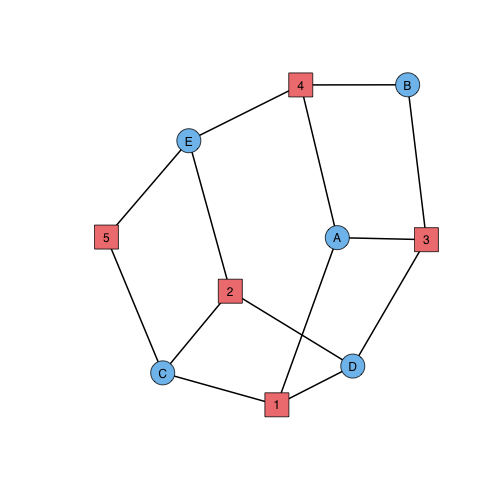
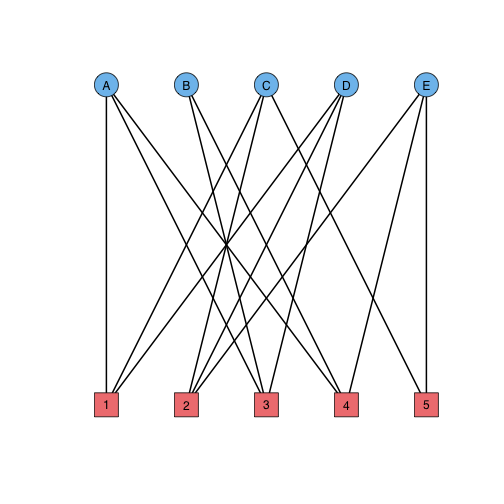

Triadic analyses of two-mode networks
=====================================

The paper "Triadic analysis for two-mode networks" makes a case for adopting a coherent batch of triad-centric tools for the study of two-mode, usually affiliation, networks. This R Markdown file will apply these tools to the study of several manageably-sized real-world affiliation networks, in hopes of giving the reader a feel for what they mean, how they can be used, and what can be learned from them.

We use the "igraph" package, which provides the class of graphs and the basic suite of tools we build upon. We'll also read data and functions from the github account corybrunson; the function 'source_https' is taken from [tonybreyal](http://tonybreyal.wordpress.com/2011/11/24/source_https-sourcing-an-r-script-from-github/ "tonybreyal").


```r
library(igraph)
mydir <- 'https://raw.githubusercontent.com/corybrunson/triadic/master/'
mycsv <- function(data.file, ...) {
  require(RCurl)
  read.csv(text = getURL(paste(mydir, 'data/', data.file, sep = '')), ...)
}
source_https <- function(url, ...) {
  require(RCurl)
  # parse and evaluate each .R script
  sapply(c(url, ...), function(u) {
    eval(parse(text = getURL(u, followlocation = TRUE,
                             cainfo = system.file("CurlSSL", "cacert.pem",
                                                  package = "RCurl"))),
         envir = .GlobalEnv)
  })
}
myfn <- function(fn.file) {
  source_https(paste(mydir, 'functions/', fn.file, sep = ''))
}
```

The author is neither a programmer nor a computer scientist by training; any suggestions on how to make this document or the suite of functions it overviews would be most welcome.

## Network 1: Southern women

In their book *Deep South*, social anthropologists Davis, Gardner, and Gardner presented, amidst other more typical tables of sociometric data, tables of coattendance at distinct events by three groups of acquainted women in the town of Natchez, Mississippi. One of these, labeled Clique A, is depicted in Fig. 11 on p. 209. The clique consists of five women, designated "Miss A" through "Miss E", each of whom attended some of five recorded events, which we refer to as bridge, dinner, movies, dance, and visiting. The attendance table is reproduced in the file "DGG\_Clique\_A.csv", which we load into R directly as a graph:


```r
women <- graph.incidence(as.matrix(mycsv('DGG_Clique_A.csv', row.names = 1)))
```

```
## Loading required package: RCurl
## Loading required package: bitops
```

Since the graph is bipartite, we can get all the incidence information we need from one corner of the full adjacency matrix. Due to the structure of the file and the import method, the actor nodes are listed first and the event nodes second:


```r
get.incidence(women)
```

```
##        Bridge Dinner Movies Dance Visiting
## Miss A      1      0      1     1        0
## Miss B      0      0      1     1        0
## Miss C      1      1      0     0        1
## Miss D      1      1      1     0        0
## Miss E      0      1      0     1        1
```

First let's visualize the network, using the visual scheme from [Opsahl's paper](http://toreopsahl.com/2011/12/21/article-triadic-closure-in-two-mode-networks-redefining-the-global-and-local-clustering-coefficients/ "Opsahl"):


```r
plot(women, layout = matrix(c(rep(seq(-1, 1, length.out = 5), times = 2),
                              rep(c(1, -1), each = 5)), nc = 2),
     vertex.color = ifelse(V(women)$type == 0, 'SkyBlue2', 'lightcoral'),
     vertex.shape = ifelse(V(women)$type == 0, 'circle', 'square'),
     edge.width = 2, edge.color = 'black',
     vertex.label = c(LETTERS[1:5], 1:5),
     vertex.label.family = 'sans', vertex.label.color = 'black')
```

 

The individuals and events are pretty evenly connected--three ties each, except for one individal (Miss B) and one event (visiting) having two ties each. The layout clearly distinguishes the nodes but offers only indirect insight into the relative rates of attendance of the individuals or events. Alternatively, we can visualize the nodes using the Fruchterman-Reingold algorithm:


```r
set.seed(10)
plot(women, layout = layout.fruchterman.reingold(women, niter = 100),
     vertex.color = ifelse(V(women)$type == 0, 'SkyBlue2', 'lightcoral'),
     vertex.shape = ifelse(V(women)$type == 0, 'circle', 'square'),
     edge.width = 2, edge.color = 'black',
     vertex.label = c(LETTERS[1:5], 1:5),
     vertex.label.family = 'sans', vertex.label.color = 'black')
```

 

This layout reveals a symmetry of the network between its actor and event nodes: Exchanging Miss A and Event 2, Miss B and Event 5, and so on yields a graph isomorphism. Thus any structural information we learn about the actors in this network can be flipped into equivalent information about the events.

This social network is just large enough exhibit a diversity of triads and just small enough to allow us to examine them in detail. (Future networks will only be examined cursorily or through statistics.) We can view the (undirected) triad census of the one-mode projection, taking the actor-based one-mode projection:


```r
myfn('simple.triad.census.R')
```


```r
simple.triad.census(bipartite.projection(women)[[1]])
```

```
## [1] 0 0 3 7
```

We have no disconnected triples at all; only three 'wedges' or 'vees' and seven 'triangles'. But these probably exhibit some diversity of their own that is lost in the projection. We can take a look at the two-mode triad census using the function 'twomode.triad.census':


```r
myfn('partition.bijections.R')
myfn('twomode.triad.census.R')
```


```r
twomode.triad.census(women, rcnames = TRUE)
```

```
## Error: unused argument (rcnames = TRUE)
```

